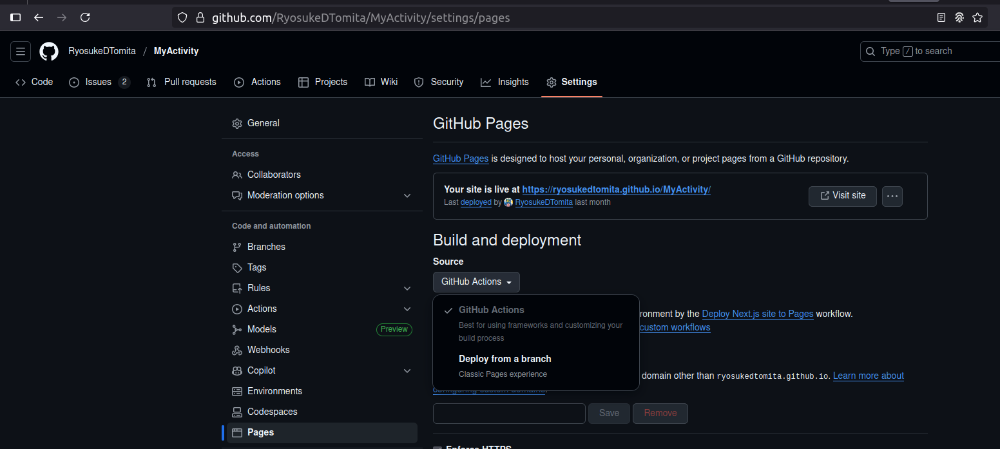
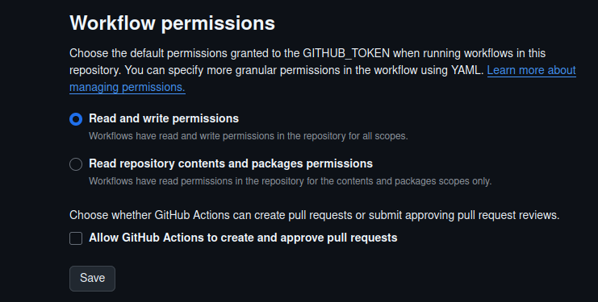

# URLメモ


## INDEX

- [ABOUT](#about)
- [ENVIRONMENT](#environment)
- [PREPARING](#preparing)
- [HOW TO USE](#how-to-use)
- [FEATURES](#features)

---

## ABOUT

A minimal memo app that saves your text in the URL query string.

- It works without a backend server
- simply saving or sharing the URL
- No need to register account.

You can synchronize memos across multiple devices or share them with other users.

https://ryosukedtomita.github.io/url-query-memo

URLのクエリ文字列にテキストを保存する、最小構成のメモアプリです。

- バックエンドサーバーは不要
- URLを保存・共有するだけで使えます
- アカウント登録も不要

メモは複数のデバイス間で同期したり、他のユーザーと共有したりできます。

---

## ENVIRONMENT

- [Next.js](https://nextjs.org/) 15
- TypeScript
- Tailwind CSS
- Jest + React Testing Library
- GitHub Pages

---

## PREPARING

### Local environment

```shell
cd url-query-memo/url-memo-app
npm install
```

```shell
npm run dev
```

go to http://localhost:3000/url-query-memo


### GitHub settings

1. GitHub Pages --> Build and deployment --> SourceをGitHub Actionsに
    
2. Actions --> Workflow permissions --> Read and write permissions
    

### Deploy to GitHub Pages via GitHub Actions

1. push to main branch
2. go to https://ryosukedtomita.github.io/url-query-memo

---

## HOW TO USE

1. Createing and Editing Memos
    - Enter your memo in the text area.
    - Changes are automatically reflected in the URL.
2. Saving
    - Click the "Save as Bookmark" button
    - Follow the instructions to update your browser’s bookmark
3. Sharing
    - Click the "Share" button to copy the URL to your clipboard
    - Send the URL to others to share your memo

---

## Security and Privacy

⚠️ Important: Memo content is embedded in the URL. Please keep the following in mind:
- Do not enter sensitive information such as passwords or personal data
- Anyone with the URL can view the content, so be cautious when sharing
- Your memo may remain in your browser’s history
